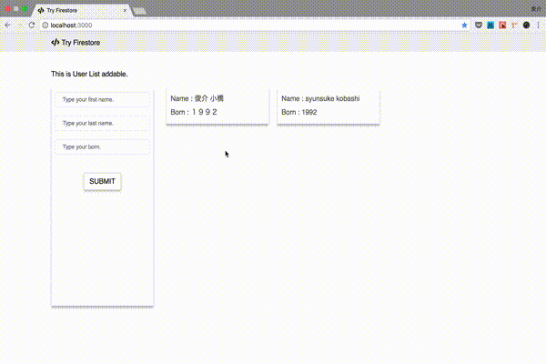

# Try Firestore

Cloud FirestoreをReactで試すためのアプリ



# Get started

```
git clone https://github.com/ksyunnnn/TryFirestore.git
cd TryFirestore
yarn
yarn start # after setting
```

# Setting

firebaseコンソールを確認し、`firebase/config.js`を作成してください。

firebase/config.js
```
export const firebaseConfig = {
  apiKey: "your api key",
  authDomain: "your domain",
  databaseURL: "your database url",
  projectId: "your project id",
  storageBucket: "your starage bucket",
  messagingSenderId: "your messagingSenderId"
};
```

# 参考にした

#### セットアップ周り
https://qiita.com/gonta616/items/278a7e81a8b624d9621e
https://firebase.google.com/docs/firestore/quickstart?authuser=0


#### コーディング
https://github.com/guilherme6191/fideliza-card/blob/ad9b12b1ea5fc11cc201d485e45dc2e138b7d69e/src/helpers/campaigns.js


#### firebaseの扱い
https://qiita.com/subaru44k/items/a88e638333b8d5cc29f2
